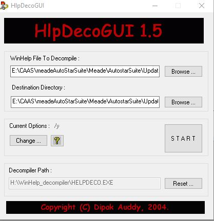
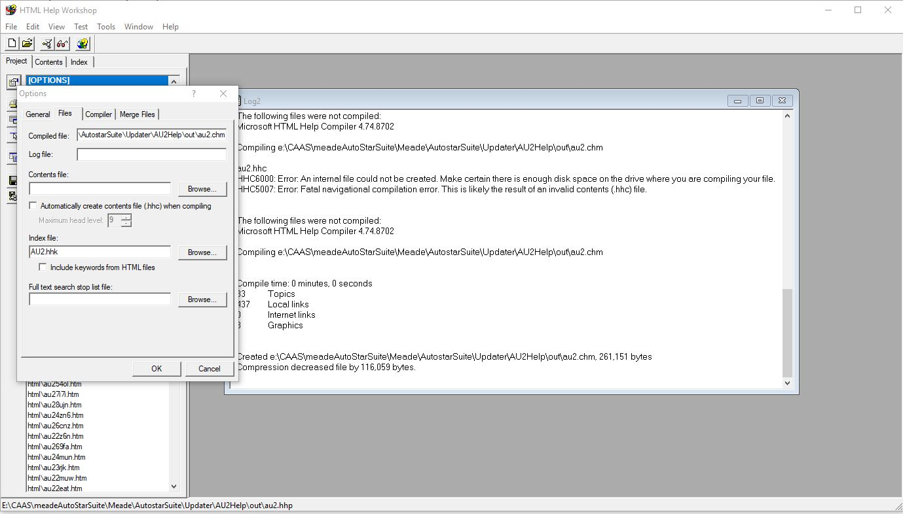

# meade-autostarsuite-helpfiles
This repo contains the autostarsuite help files converted to a modern format.

## Conversion Process:

I followed [this](http://www.help-info.de/en/Help_Info_WinHelp/hw_converting.htm#Conversion) tutorial.

### Step 1 - Decompile the hlp file:
Download [HELPDECO Command Program Launcher](http://www.help-info.de/en/Help_Info_WinHelp/hw.htm) and HlpDecoGUI. When you open HlpDecoGUI point the executable to HELPDECO.EXE in the HELPDECO directory. Open the .hlp file and set the destination directory. The decompiler will generate several files one of which will be an .hpj. This will be the target of Help Workshop.

### Step2 - Use HTML Help Workshop to create a chm:
In the File menu open New/Project and check the project wizard.

Open the .hpj that was generated. I had to dink with some aspects of the compilation for some of the files. For example, the au2 was looking for a non existant .hhc. Click the compile icon (left of glasses.) and the chm will be generated.

